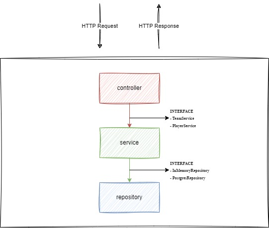

# ScorePlay

## Description

This service exposes a REST API to manage sports teams and their players.

## Solution Design

### Dependencies

- [gin](https://gin-gonic.com/) - Gin is a HTTP web framework written in Go (Golang).
- [v10](https://pkg.go.dev/github.com/go-playground/validator/v10) - Package validator implements value validations for structs and individual fields based on tags. 
- [gin-swagger](https://pkg.go.dev/github.com/swaggo/gin-swagger) - Gin middleware to automatically generate RESTful API documentation with Swagger 2.0.

### Assumptions

- A team is created without players.
- There is a dedicated endpoint to list the players for a specific team, so the endpoint to get all teams will not list the players.

### Future Improvements

- Authentication/authorization on the exposed REST API endpoints.
- Pagination for endpoints that list all teams or players.
- Improved error handling with business exceptions.
- Structured logging.